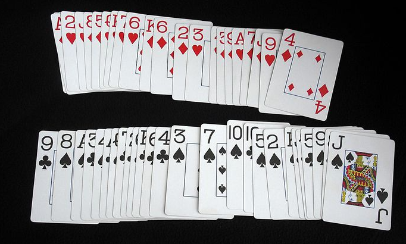

# navigation App - React Native

This section consists of two parts in which we will see the types of navigation that we have at our disposal.

Here we will start with the **Stack and Drawer navigation**, understanding each of the different navigation controls is a fundamental piece in any mobile application, so let's try to learn each one of them to be able to mix them and achieve the objective we have for our application.

# Navigation

We will use [React Navigation](https://reactnavigation.org/docs/stack-navigator/) for our screen navigation.

We can install follow [Started steps](https://reactnavigation.org/docs/getting-started)

## How many Navigation types exist?

We can use 4 typo of navigation:

1. Stack navigation

   Works like a deck of cards:
   
   And we have some method to mutated

   - `navigation.navigate` Allows us navigate between all screens staked
   - `navigation.pop` Delete the active screen
   - `popToTop` Go to te first screen
   - `goBack` Go to last screen

2. Drawer Navigation
3. BottomTab Navigation
4. MaterialTop Navigation

# Way to navigate in screens

## 1.

```js
import {StackScreenProps} from '@react-navigation/stack';
import React from 'react';
import {Button, Text, View} from 'react-native';
import {styles} from '../theme/appTheme';

interface Props extends StackScreenProps<any, any> {}

export const PageOneScreen = ({navigation}: Props) => {
  return (
    <View style={styles.globalMargin}>
      <Text>Page 1 Screen</Text>
      <Button
        title="Go Page Two"
        onPress={() => navigation.navigate('PageTwoScreen')}
      />
    </View>
  );
};
```

## 2.

```js
import React from 'react';
import {useNavigation} from '@react-navigation/core';
import {Button, Text, View} from 'react-native';
import {styles} from '../theme/appTheme';

export const PageTwoScreen = () => {
  const navigation = useNavigation();

  return (
    <View style={styles.globalMargin}>
      <Text>Page 2 Screen</Text>
      <Button
        title="Go Page Three"
        onPress={() => navigation.navigate('PageThreeScreen')}
      />
    </View>
  );
};
```
